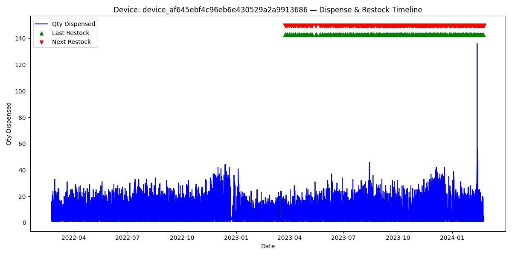

# Vending Machine Inventory Turnover & Restocking Analytics

This project provides an end-to-end data analysis pipeline for vending machine inventory and restocking data. It includes cleaning, exploratory data analysis (EDA), feature engineering, supply-demand timeline visualization, and reporting for decision support in inventory optimization.

---

##  Project Overview

The main objectives of this analysis are:

- Clean and preprocess inventory and restock data
- Analyze demand patterns and seasonality
- Engineer features for forecasting or ML modeling
- Visualize dispense vs. restock timelines
- Reveal insights into device usage and supply efficiency

---

##  Dataset Description

### 1. `Inventory_Turnover.csv`

| Column         | Description                           |
|----------------|---------------------------------------|
| sku            | Unique item identifier                |
| device_id      | Identifier of vending machine         |
| package_qty    | Quantity per package                  |
| qty_dispensed  | Quantity dispensed on that day        |
| dispense_date  | Date of the dispensing event          |

### 2. `Restock_data.csv`

| Column         | Description                           |
|----------------|---------------------------------------|
| device_id      | Vending machine identifier            |
| total          | Total value or units restocked        |
| restock_date   | Date of restocking                    |
| currency_code  | Currency used                         |

---

## Features

### Data Cleaning & Preparation

- Converted date columns to `datetime` format
- Trimmed whitespace in string fields (e.g., `device_id`, `sku`)
- Ensured numerical columns were correctly typed
- Removed duplicate entries
- Added helper time features: `day`, `month`, `week`, `year`

### Exploratory Data Analysis (EDA)

- Distribution plots of quantity dispensed vs. package size
- Time series plots for daily, weekly, and monthly trends
- Seasonal trends by weekday and month
- Device-level dispense volume trends
- Sweetviz and YData-Profiling reports

### Feature Engineering

- **Lag-based features**: `lag_1`, `lag_7`, `rolling_7_mean`, `rolling_7_std`
- **Time-based features**: `is_weekend`, `day_of_week`, `day_num`
- **Cumulative trends**: running total of items dispensed
- **Supply-demand window**:
  - `days_since_restock`
  - `days_until_next_restock`

### Visualization Outputs

All plots are saved under the `/plots` directory. Examples:

- `daily_quantity_dispensed.png`
- `demand_by_day_of_week.pdf`
- `device_13686_Dispense_and_Restock_Timeline.png`

---

## Sample Plot: Dispense vs. Restock Timeline

---